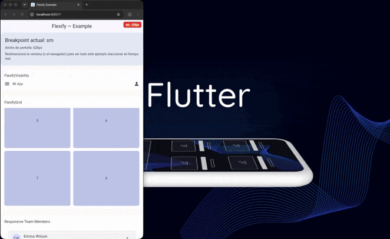

<h1 align="start">Breakify</h1>

<p align="start">
  <a href="https://pub.dev/packages/breakify">
    
  </a>
  <a href="https://github.com/josueSerna/breakify">
    
  </a>
</p>

<p align="center">
  
</p>

<p align="start">
A lightweight responsive layout toolkit for Flutter.
</p>

<p align="start">
Build responsive applications using breakpoints, responsive values,
and adaptive widgets without scattering screen size checks throughout your code.
</p>

<p align="start">
Designed to work seamlessly on mobile, tablet, desktop, and Flutter Web.
</p>

<p align="center">
  
</p>

<p align="start">
  <i>
  This demo was recorded using Flutter Web to make responsive behavior easier
    to visualize. Breakify also works seamlessly on mobile apps and tablets.
</p>

---

## Features

* Responsive breakpoints
* Responsive values with automatic fallback
* Fluid values with smooth interpolation
* Adaptive row/column layouts
* Responsive containers
* Responsive grids
* Responsive list views
* Conditional visibility by breakpoint
* Development breakpoint banner
* Lightweight and dependency-free

---

## Installation

Add Breakify to your `pubspec.yaml`.

```yaml
dependencies:
  breakify: ^0.1.0
```

Then import the package.

```dart
import 'package:breakify/breakify.dart';
```

---

# Quick Start

Wrap your application with `BreakifyScope`.

```dart
void main() {
  runApp(
    BreakifyScope(
      child: MaterialApp(
        home: HomePage(),
      ),
    ),
  );
}
```

This makes responsive information available throughout the widget tree.

---

# Default Breakpoints

Breakify includes five responsive breakpoints by default.

| Breakpoint | Minimum width |
| ---------- | ------------: |
| sm         |           640 |
| md         |           768 |
| lg         |          1024 |
| xl         |          1280 |
| xxl        |          1536 |

You can also provide your own breakpoint configuration.

```dart
const breakpoints = BreakifyBreakpoints(
  sm: 500,
  md: 700,
  lg: 900,
  xl: 1200,
  xxl: 1600,
);
```

```dart
BreakifyScope(
  breakpoints: breakpoints,
  child: MyApp(),
)
```

---

# Responsive Values

Instead of manually checking the screen width, define how a value should behave.

```dart
const columns = BreakifyValue(
  sm: 1,
  md: 2,
  lg: 4,
);

final value = context.resolve(columns);
```

Missing breakpoints automatically inherit the nearest previous value.

For example:

| Breakpoint | Value |
| ---------- | ----: |
| sm         |     1 |
| md         |     2 |
| lg         |     4 |
| xl         |     4 |
| xxl        |     4 |

---

# Fluid Values

Need values to scale smoothly instead of changing abruptly?

Use `BreakifyFluidValue`.

```dart
const spacing = BreakifyFluidValue(
  sm: 8,
  md: 16,
  lg: 24,
);

Container(
  padding: EdgeInsets.all(
    context.resolve(spacing),
  ),
)
```

Instead of jumping from one value to another, Breakify interpolates between breakpoints.

---

# BuildContext Extensions

Breakify provides useful extensions for accessing responsive information.

```dart
context.breakpoint
```

Returns the current breakpoint.

```dart
context.breakifyWidth
```

Returns the current width.

```dart
context.resolve(value)
```

Resolves any `BreakifyResolvable`.

---

# Widgets

## BreakifyAdaptiveLayout

Automatically switches between a `Column` and a `Row`.

```dart
BreakifyAdaptiveLayout(
  breakpoint: BreakifyBreakpoint.lg,
  spacing: const BreakifyValue(
    sm: 12,
    lg: 24,
  ),
  children: [
    Sidebar(),
    Content(),
  ],
)
```

---

## BreakifyGrid

Responsive grid with configurable columns.

```dart
BreakifyGrid(
  columns: const BreakifyValue(
    sm: 2,
    md: 3,
    lg: 4,
  ),
  spacing: const BreakifyFluidValue(
    sm: 8,
    lg: 20,
  ),
  children: products,
)
```

---

## BreakifyListView

Responsive list with configurable spacing.

```dart
BreakifyListView(
  spacing: const BreakifyValue(
    sm: 8,
    lg: 16,
  ),
  itemCount: items.length,
  itemBuilder: (context, index) {
    return ListTile(
      title: Text(items[index]),
    );
  },
)
```

---

## BreakifyContainer

Centers content while limiting its maximum width.

```dart
BreakifyContainer(
  maxWidth: const BreakifyValue(
    sm: 1200,
  ),
  child: content,
)
```

---

## BreakifyVisibility

Show or hide widgets depending on the current breakpoint.

```dart
BreakifyVisibility(
  minBreakpoint: BreakifyBreakpoint.lg,
  child: Sidebar(),
)
```

Or show only on specific breakpoints.

```dart
BreakifyVisibility.only(
  visibleIn: {
    BreakifyBreakpoint.sm,
    BreakifyBreakpoint.xl,
  },
  child: Logo(),
)
```

---

## BreakifyBuilder

Build widgets based on the current breakpoint.

```dart
BreakifyBuilder(
  builder: (context, breakpoint, constraints) {
    return Text(
      breakpoint.name,
    );
  },
)
```

---

## BreakifyDebugBanner

Displays the current breakpoint during development.

```dart
BreakifyDebugBanner(
  child: MyApp(),
)
```

---

# Why Breakify?

Without Breakify, responsive layouts often require manually checking screen sizes throughout your widgets.

```dart
if (MediaQuery.sizeOf(context).width >= 1024) {
  ...
}
```

or

```dart
LayoutBuilder(
  builder: ...
)
```

Breakify lets you describe how your UI should behave instead.

```dart
BreakifyAdaptiveLayout(
  breakpoint: BreakifyBreakpoint.lg,
  spacing: const BreakifyFluidValue(
    sm: 12,
    lg: 24,
  ),
  children: [
    LeftPanel(),
    RightPanel(),
  ],
)
```

The responsive logic stays centralized, making your widgets easier to read, maintain, and reuse.

---

# Example

A complete example application is available in the example folder.

Run the example on Flutter Web:

```bash
flutter run -d chrome
```

Or run it on any connected device (Android, iOS, desktop, or the default emulator):

```bash
flutter run
```

---

# License

This project is licensed under the MIT License.

# Author

Developed and maintained by Josue Serna.

GitHub: https://github.com/josueSerna