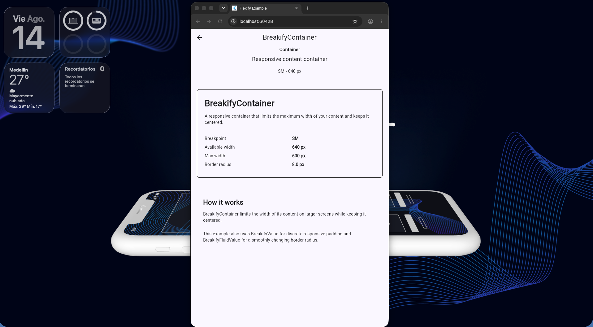
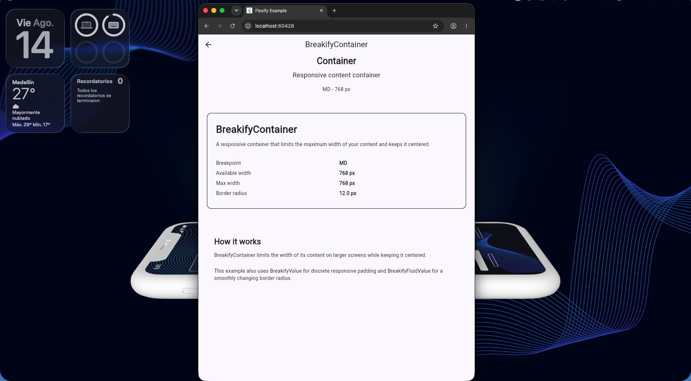
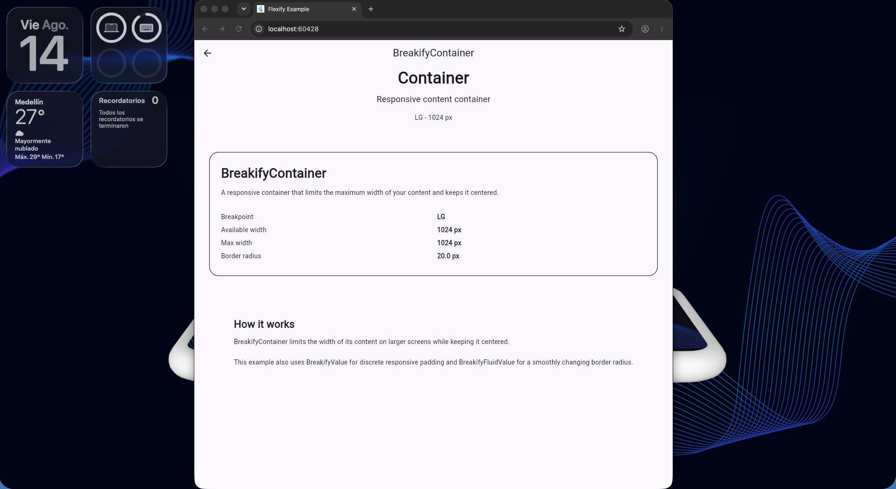
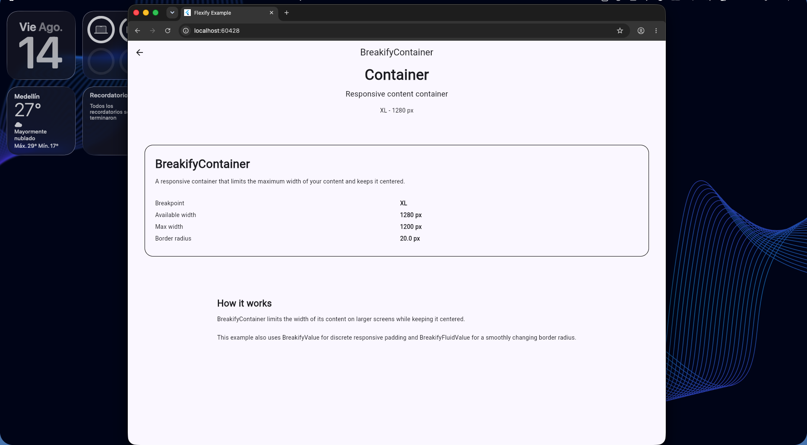
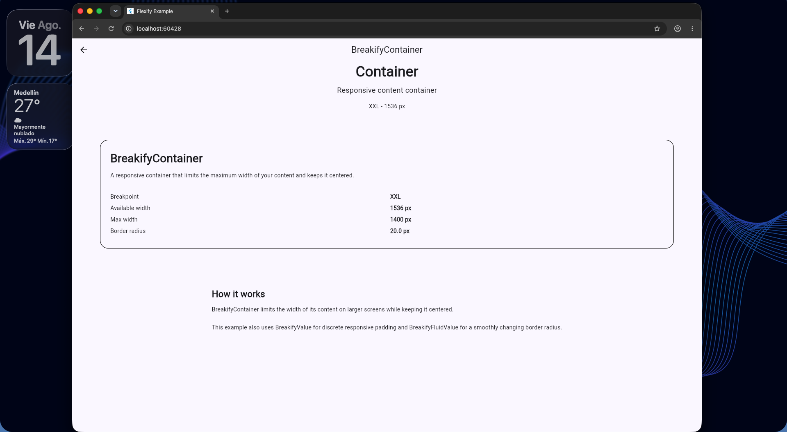

<h1 align="start">Breakify</h1>

<p align="start">
  <strong>A responsive layout toolkit for Flutter.</strong>
</p>

<p align="start">
  Build responsive interfaces using breakpoints, responsive values,
  fluid interpolation, and adaptive widgets.
</p>

<p align="center">
  <a href="https://pub.dev/packages/breakify">
    
  </a>
  <a href="https://github.com/josueSerna/breakify">
    
  </a>
  <a href="https://pub.dev/packages/breakify">
    
  </a>
  <a href="https://pub.dev/packages/breakify">
    
  </a>
  <a href="https://github.com/josueSerna/breakify/blob/main/LICENSE">
    
  </a>
  
</p>

<p align="center">
  
</p>

<p align="center">
    
  </p>


---

## Table of Contents

- [What is Breakify?](#what-is-breakify)
- [Why Breakify?](#why-breakify)
- [Features](#features)
- [Requirements](#requirements)
- [Installation](#installation)
- [Quick Start](#quick-start)
- [Default Breakpoints](#default-breakpoints)
- [Responsive Values](#responsive-values)
- [Fluid Values](#fluid-values)
- [BuildContext Extensions](#buildcontext-extensions)
- [Widgets](#widgets)
  - [BreakifyAdaptiveLayout](#breakifyadaptivelayout)
  - [BreakifyGrid](#breakifygrid)
  - [BreakifyListView](#breakifylistview)
  - [BreakifyContainer](#breakifycontainer)
  - [BreakifyVisibility](#breakifyvisibility)
  - [BreakifyBuilder](#breakifybuilder)
  - [BreakifyDebugBanner](#breakifydebugbanner)
- [Responsive Preview](#responsive-preview)
- [Example App](#example-app)
- [Contributing](#contributing)
- [License](#license)
- [Author](#author)

---

## What is Breakify?

Breakify is a lightweight responsive layout toolkit for Flutter designed to make responsive UI easier to build and maintain.

Instead of repeatedly checking screen dimensions throughout your widgets:

```dart
if (MediaQuery.sizeOf(context).width >= 1024) {
  // ...
}
```

Breakify lets you describe **how a value or layout should behave** across screen sizes, and takes care of resolving it for you.

---

## Why Breakify?

Without Breakify, responsive layouts often require manually checking screen sizes throughout your widgets:

```dart
if (MediaQuery.sizeOf(context).width >= 1024) {
  ...
}
```

or reaching for a `LayoutBuilder` every time:

```dart
LayoutBuilder(
  builder: (context, constraints) {
    // ...
  },
)
```

With Breakify, the same logic becomes declarative:

```dart
BreakifyAdaptiveLayout(
  breakpoint: BreakifyBreakpoint.lg,
  spacing: const BreakifyFluidValue(
    sm: 12,
    lg: 24,
  ),
  children: [
    LeftPanel(),
    RightPanel(),
  ],
)
```

| Without Breakify | With Breakify |
|---|---|
| Screen-size checks scattered across widgets | Responsive logic centralized in one value |
| Manual `LayoutBuilder` boilerplate per widget | Built-in adaptive widgets |
| Hard breakpoint jumps | Optional fluid interpolation |
| Easy to forget a breakpoint case | Automatic fallback to the nearest defined value |

The responsive logic stays centralized, making your widgets easier to read, maintain, and reuse.

---

## Features

* Responsive breakpoints
* Fluid values with smooth interpolation
* Adaptive row/column layouts
* Responsive containers
* Responsive grids (including horizontal scroll and equal-height rows)
* Responsive list views (vertical and horizontal)
* Conditional visibility by breakpoint
* Development breakpoint banner

---

## Requirements

* Dart SDK `>=3.0.0`
* Flutter SDK `>=3.0.0`

---

## Installation

Add Breakify to your `pubspec.yaml`.

```yaml
dependencies:
  breakify: ^0.1.1
```

Then import the package.

```dart
import 'package:breakify/breakify.dart';
```

---

## Quick Start

Wrap your application with `BreakifyScope`.

```dart
void main() {
  runApp(
    BreakifyScope(
      child: MaterialApp(
        home: HomePage(),
      ),
    ),
  );
}
```

This makes responsive information available throughout the widget tree.

---

## Default Breakpoints

Breakify includes five responsive breakpoints by default.

| Breakpoint | Minimum width |
| ---------- | ------------: |
| sm         |           640 |
| md         |           768 |
| lg         |          1024 |
| xl         |          1280 |
| xxl        |          1536 |

You can also provide your own breakpoint configuration.

```dart
const breakpoints = BreakifyBreakpoints(
  sm: 500,
  md: 700,
  lg: 900,
  xl: 1200,
  xxl: 1600,
);
```

```dart
BreakifyScope(
  breakpoints: breakpoints,
  child: MyApp(),
)
```

> **Note:** every breakpoint width shown in this README — including the
> [Responsive Preview](#responsive-preview) below — uses these defaults.
> Since breakpoints are fully customizable, your own app may switch
> layouts at different widths.

---

## Responsive Values

Instead of manually checking the screen width, define how a value should behave.

```dart
const columns = BreakifyValue(
  sm: 1,
  md: 2,
  lg: 4,
);

final value = context.resolve(columns);
```

Missing breakpoints automatically inherit the nearest previous value.

For example:

| Breakpoint | Value |
| ---------- | ----: |
| sm         |     1 |
| md         |     2 |
| lg         |     4 |
| xl         |     4 |
| xxl        |     4 |

---

## Fluid Values

Need values to scale smoothly instead of changing abruptly?

Use `BreakifyFluidValue`.

```dart
const spacing = BreakifyFluidValue(
  sm: 8,
  md: 16,
  lg: 24,
);

Container(
  padding: EdgeInsets.all(
    context.resolve(spacing),
  ),
)
```

Instead of jumping from one value to another, Breakify interpolates between breakpoints.

---

## BuildContext Extensions

Breakify provides useful extensions for accessing responsive information.

```dart
context.breakpoint
```

Returns the current breakpoint.

```dart
context.breakifyWidth
```

Returns the current width.

```dart
context.resolve(value)
```

Resolves any `BreakifyResolvable`.

---

## Widgets

### BreakifyAdaptiveLayout

Automatically switches between a `Column` and a `Row`.

```dart
BreakifyAdaptiveLayout(
  breakpoint: BreakifyBreakpoint.lg,
  spacing: const BreakifyValue(
    sm: 12,
    lg: 24,
  ),
  children: [
    Sidebar(),
    Content(),
  ],
)
```

---

### BreakifyGrid

Responsive grid with configurable columns, spacing, and aspect ratio.

```dart
BreakifyGrid(
  columns: const BreakifyValue(
    sm: 2,
    md: 3,
    lg: 4,
  ),
  spacing: const BreakifyFluidValue(
    sm: 8,
    lg: 20,
  ),
  children: products,
)
```

It also supports:

* **Horizontal scrolling** — set `scrollDirection: Axis.horizontal` to
  scroll sideways instead of vertically. In this mode, `columns` controls
  the number of rows instead of columns, and `childAspectRatio` is still
  expressed as width / height.
* **Equal-height rows** — set `equalHeight: true` to make every item in a
  row match the height of the tallest item in that row. Useful for grids
  with items of varying intrinsic height. Currently only supported with
  `Axis.vertical`.

```dart
BreakifyGrid(
  columns: const BreakifyValue(sm: 1, md: 2, lg: 3),
  scrollDirection: Axis.horizontal,
  spacing: const BreakifyFluidValue(sm: 8, lg: 20),
  children: cards,
)
```

---

### BreakifyListView

Responsive list with configurable spacing and separators.

```dart
BreakifyListView(
  spacing: const BreakifyValue(
    sm: 8,
    lg: 16,
  ),
  itemCount: items.length,
  itemBuilder: (context, index) {
    return ListTile(
      title: Text(items[index]),
    );
  },
)
```

Supports a custom `separator` widget (replacing the default spacing) and
`scrollDirection: Axis.horizontal` for horizontal lists.

---

### BreakifyContainer

Centers content while limiting its maximum width.

```dart
BreakifyContainer(
  maxWidth: const BreakifyValue(
    sm: 1200,
  ),
  child: content,
)
```

---

### BreakifyVisibility

Show or hide widgets depending on the current breakpoint.

```dart
BreakifyVisibility(
  minBreakpoint: BreakifyBreakpoint.lg,
  child: Sidebar(),
)
```

Or show only on specific breakpoints.

```dart
BreakifyVisibility.only(
  visibleIn: {
    BreakifyBreakpoint.sm,
    BreakifyBreakpoint.xl,
  },
  child: Logo(),
)
```

---

### BreakifyBuilder

Build widgets based on the current breakpoint.

```dart
BreakifyBuilder(
  builder: (context, breakpoint, constraints) {
    return Text(
      breakpoint.name,
    );
  },
)
```

---

### BreakifyDebugBanner

Displays the current breakpoint during development.

```dart
BreakifyDebugBanner(
  child: MyApp(),
)
```

---

## Responsive Preview

The screenshots below were captured from the app in [`/example`](example),
resized across each breakpoint.

> These previews use Breakify's **default** breakpoint widths (see the
> [Default Breakpoints](#default-breakpoints) table above). Breakpoints are
> fully customizable via `BreakifyBreakpoints`, so an app using custom
> values will switch layouts at different widths — the *behavior* shown
> here (how many columns, how the layout adapts) is what stays consistent,
> not the exact pixel value.

<table align="center">
  <tr>
    <td align="center">
      <br>
      <sub><b>sm</b> · phone</sub>
    </td>
    <td align="center">
      <br>
      <sub><b>md</b> · large phone / small tablet</sub>
    </td>
    <td align="center">
      <br>
      <sub><b>lg</b> · tablet / small laptop</sub>
    </td>
    <td align="center">
      <br>
      <sub><b>xl</b> · laptop / desktop</sub>
    </td>
    <td align="center">
      <br>
      <sub><b>xxl</b> · large desktop</sub>
    </td>
  </tr>
</table>

<!--
  How to regenerate these screenshots:
  1. Run the example app: flutter run -d chrome
  2. Resize the browser window to each default breakpoint width
     (640, 768, 1024, 1280, 1536) — or a representative width just
     above each one.
  3. Capture a screenshot and save it as assets/preview_<breakpoint>.png
-->

---

## Example App

A complete example application is available in the [`example`](example) folder.

Run the example on Flutter Web:

```bash
flutter run -d chrome
```

Or run it on any connected device (Android, iOS, desktop, or the default emulator):

```bash
flutter run
```

---

## License

This project is licensed under the MIT License.

## Author

Developed and maintained by Josue Serna.

GitHub: https://github.com/josueSerna